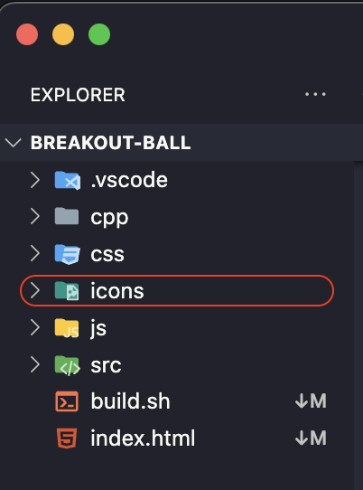

# <h1 align="center"> **`How to use icons`** </h1>

## `STEP 1:` Download the **sb_icons.zip** File
> ### Download: Get the **sb_icons.zip** file from the **Repository** or **SB Icons Website**
## `STEP 2:` Extract the File
> ### Extract: Unzip the **sb_icons.zip** file to a location on your computer.
## `STEP 3:` Copy the icons Folder
> ### Copy: Find the icons folder inside the extracted files and copy it.
## `STEP 4:` Paste the Folder in Your Project Root Directory
> ### Paste: Go to your project's root directory and paste the icons folder there.

## `STEP 5:` Add the Icons CSS to Your HTML
> ### Open HTML File: Open your main HTML file (e.g., index.html).
> ### Add Link Tag:
- #### Copy this line:
```html
   <link rel="stylesheet" href="./icons/css/icon.css">
```
- Paste it inside the <head> section of your HTML file:
```html
   <head>
      <link rel="stylesheet" href="./icons/css/icon.css">
      <!-- Other head elements -->
   </head>
```

- Example Code
```html
   <!DOCTYPE html>
   <html lang="en">
   <head>
      <meta charset="UTF-8">
      <meta name="viewport" content="width=device-width, initial-scale=1.0">
      <title>My Project</title>
      <link rel="stylesheet" href="./icons/css/icon.css">
   </head>
   <body>
      <p>Home Icon: <i class="sbi-home"></i></p>
      <p>User Icon: <i class="sbi-user"></i></p>
      <!-- Add more icons as needed -->
   </body>
   </html>
```
## <p align="center"> `That's it! (done)` </p>

# Website link [SB Icons](https://elsesourav.github.io/icons/)